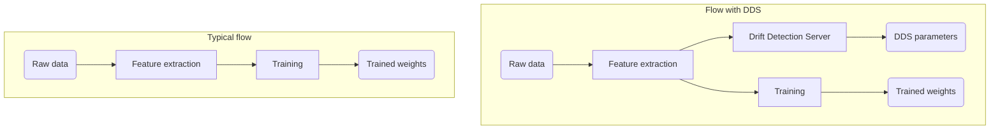

# Parallel Training and Prediction

The difference between a typical training process and
the training process with Drift Detection Server
can be presented on the graph:

The strong assumption of DDS is that the drift detector is a conceptually
inseparable part of a model. Therefore, next to inference graph, model weights,
and training metrics, drift detector is one of the ingredients of a
well-prepared and well-working Machine Learning model.

The design promoted by DDS allows doesn't assure tight connection.
The DDS parameters can be stored as artifacts but, because the
DDS is API-first, in theory, the incorrect version of Drift Detector can be used
with a given model. It's a user's responsibility to use the corresponding
drift detector.

In order to avoid the traps in this area, DDS implements two solutions:
