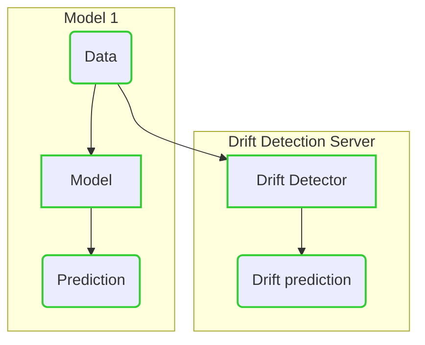
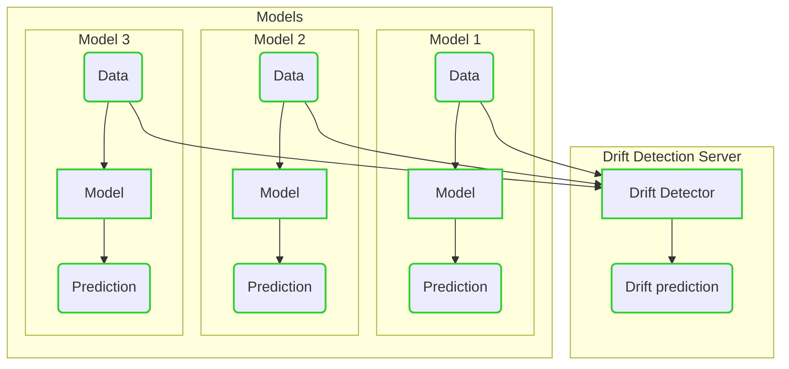
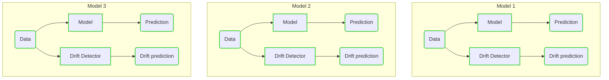

# Usage Scenarios

## 1: Single model with one drift detection server

In this case one model is making the predictions for a single task. In parallel,
drift detector is updated with the new example and predicts drift.

This is the simplest case.

### Initializing Drift Detectors

Drift Detector can be initialized in two ways - either loaded from the
artifacts, or fitted thought API/client.

### Versioning

Each Drift Detector for a model can be considered as another Project.

## 2: Many models with one drift detection server

This case is very optimized in terms of resources demand. Many models from a
team/organization can share the same server. The server management
is centralized and the processing resources are shared between Drift Detectors.

### Initializing Drift Detectors

Drift Detectors can be initialized in two ways - either loaded from the
artifacts, or fitted thought API/client. Each Drift Detector is a separate
Project - either if it's a Drift Detector for a new model, or a new version of
Drift Detector for a model.

### Versioning

Each Drift Detector for a model can be considered as another Project.

## 3: Many models with corresponding drift detection servers

In fact this is Scenario 1, but copied and applied to many models.

In this scenario, the separation of the projects is the clearest. However, it
doesn't take advantage of the whole power of Drift Detection Server.

We do not advice this setup as the management cost is high, and many powerful
functions from Drift Detection Server can't be used.

### Initializing Drift Detectors

If the user decides for this setup, it is probably due to safety requirements
or specific agreements. Even though solution seems to very clean, it is not
well optimized, as the Drift Detection Server pods may wait idle for
a long time.

In this setup, Drift Detector is probably initialized together with each
Drift Detection Server, so not created by `/fit` method. The users will probably
want to load the Drift Detector on startup.

All the management of each Drift Detector has to be done on the user side.

### Versioning

1. If each Drift Detector is created as new Drift Detection Server,
   the versioning and updating of Drift Detectors has to be done on users end.

1. If the user wants to use the same instance (eg. EC2, or kubernetes Pod,
   Deployment) for each model, then Project may be used to differentiate
   versions.
